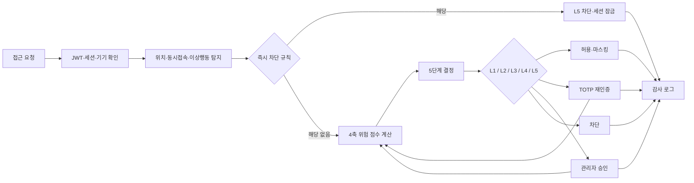

# ZeroTrust 접근제어 시스템

> 사용자에게 한 번 부여한 권한을 계속 신뢰하지 않고, **누가·어떤 자료를·어느 환경에서·어떤 방식으로 요청하는지**를 매 접근마다 다시 평가하는 Zero Trust 기반 접근제어 데모입니다.

[Windows 설치 파일 다운로드](https://github.com/wjdwoghd/zerotrust/releases/latest) · [소스 실행 안내](#소스에서-실행하기) · [시연 시나리오](source/PRESENTATION_DEMO.md) · [설계 보고서](docs/REPORT.md) · [개발 규칙](CONTRIBUTING.md)

## 프로젝트 소개

조직 내부의 정보 유출은 계정 탈취뿐 아니라 정상 계정의 권한 오남용으로도 발생합니다. 전통적인 역할 기반 접근제어만으로는 “경찰관 계정인가?”를 확인할 수는 있어도, “현재 이 사건을 열람할 업무상 이유가 있는가?”, “평소와 다른 기기나 위치에서 접근하는가?”, “짧은 시간에 여러 자료를 반복 조회하거나 내려받으려 하는가?”까지 판단하기 어렵습니다.

이 프로젝트는 경찰 수사자료 시스템을 가상의 적용 대상으로 삼아 다음 질문에 답하는 학부 캡스톤 프로젝트입니다.

- 정상 계정의 내부자 위협을 접근 시점에 탐지할 수 있는가?
- 단순 허용/차단 대신 위험에 비례한 추가 인증과 승인을 요구할 수 있는가?
- 긴급한 업무는 중단시키지 않으면서도 사용자의 책임과 사후 감사를 보장할 수 있는가?
- 접근 판단의 입력, 결과, 예외 사용 이력을 추적 가능한 형태로 남길 수 있는가?

시스템은 사용자의 역할만 검사하지 않습니다. 사용자 신뢰도와 직무, 자원 민감도, 담당 사건 여부, 접속 기기·위치·시간, 최근 행동을 종합해 위험 점수를 계산하고, 그 결과를 5단계 접근 수준으로 변환합니다. 고위험 조합은 점수 계산과 별개로 즉시 차단하며, 모든 중요한 판단은 감사 로그에 기록합니다.

> 이 저장소의 사용자·사건·개인정보는 기능 시연을 위해 만든 **합성 데이터**이며 실제 인물이나 사건과 무관합니다.

## 핵심 기능

### 1. 매 요청마다 실행되는 동적 접근 평가

접근 평가기는 네 가지 축을 조합합니다.

| 평가 축 | 주요 입력 | 위험도에 미치는 영향 |
|---|---|---|
| 객체 민감도 | 자료 등급 1~5, 요약·원본·증거·내부 메모 유형 | 민감한 원본이나 증거일수록 위험 증가 |
| 환경 위험도 | 등록 기기, 허용 위치, 접속 시간, 위치·기기 변화 | 낯선 환경일수록 위험 증가 |
| 행동 위험도 | 최근 5분 접근량, 비담당 사건 반복 클릭, 다운로드·복사·대량 조회, 인증 실패 | 탐색성·반복성 행동일수록 위험 증가 |
| 업무 적합도 | 담당 사건, 동일 부서, 관할 일치, 직무 연관성, 사전 승인 | 업무상 필요성이 확인될수록 위험 감소 |

기본 산식은 다음과 같습니다.

```text
최종 위험 점수 = max(0, 객체 민감도 + 환경 위험도 + 행동 위험도 - |업무 적합도|)
```

점수 가중치와 결정 경계는 PostgreSQL의 `policy_thresholds` 테이블에서 관리되며 5분 TTL 캐시를 통해 반영됩니다. 코드 재배포 없이 정책값을 조정할 수 있지만, 현재 기본값은 프로젝트 설계 보고서의 추정치이므로 실제 운영 데이터로 보정된 모델은 아닙니다.

### 2. 위험도에 비례한 5단계 접근 결과

| 레벨 | 기본 점수 구간 | 결과 | 문서 동작 |
|---|---:|---|---|
| L1 | 0~25 | 완전 허용 | 열람·다운로드·복사·인쇄 허용 |
| L2 | 26~50 | 조회만 허용 | 사용자 워터마크 적용, 다운로드·복사 차단 |
| L3 | 51~75 | 추가 인증 | 토큰 기기의 TOTP로 재인증 후 재평가 |
| L4 | 76~90 | 관리자 승인 | 명시적 승인 후 재평가, 관리자가 열람 전용/다운로드 포함을 구분 |
| L5 | 91 이상 | 차단 | 자료 본문과 문서 동작 차단 |

외부 API 응답은 내부 정책명과 상세 점수를 그대로 노출하지 않고 `ALLOW`, `VERIFY`, `DENY`의 세 상태와 요청 ID 중심으로 축약합니다. 내부 판단 근거는 관리자 화면과 감사 경로에서 확인합니다.

### 3. 점수보다 우선하는 즉시 차단 규칙

다음과 같은 명확한 고위험 조합은 일반 점수 구간을 기다리지 않고 차단합니다.

- 동시 접속, 단말 불일치, 인증 실패가 함께 발생한 경우
- 비허용 위치와 미등록 단말에서 4등급 이상 자료를 다운로드하려는 경우
- 직전 접속 위치와 현재 위치 사이의 이동이 물리적으로 불가능하다고 판단된 경우
- 사용자에게 허용되지 않은 위치에서 접근한 경우

Impossible Travel은 등록된 위치 좌표의 Haversine 거리와 거리 구간별 예상 이동시간을 비교합니다. 탐지되면 관련 세션을 재인증 대기 상태로 잠그고 감사 이벤트를 남깁니다.

### 4. 인증과 세션 보호

- 비밀번호는 bcrypt로 해시합니다.
- 로그인과 재인증에 RFC 6238 방식의 6자리 TOTP를 사용합니다.
- OTP는 한 번 소비한 time-step의 재사용을 막습니다.
- JWT의 서명뿐 아니라 issuer와 audience를 검증합니다.
- 비밀번호 연속 실패가 임계값에 도달하면 계정을 잠급니다.
- 신뢰점수가 낮거나 위반 횟수가 많은 의심 계정은 관리자의 로그인 승인을 먼저 받아야 합니다.
- 두 번째 로그인이 감지되면 관련 세션을 잠그고, MFA에 먼저 성공한 세션만 계속 사용할 수 있습니다.
- 일반 유휴 15분, 고민감 세션 5분, 절대 8시간의 기본 만료 정책을 적용합니다.

### 5. 명시적 승인과 이중 감독

고민감·비담당 자료 또는 승인 필수 자료는 관리자 승인 흐름으로 전환됩니다. 관리자는 요청 사유와 접근 맥락을 검토한 뒤 반려하거나, 열람만 허용하거나, 다운로드까지 포함해 승인할 수 있습니다.

담당 사건 등록도 별도 요청으로 처리합니다. 관리자는 요청자에게 OTP 확인을 요구한 후 최종 배정을 승인할 수 있습니다. 요청자와 승인자가 같은 자기 승인, Break-Glass 발동자와 사후 심사자가 같은 자기 심사는 서버 단계에서 차단하고 `SELF_ACTION_BLOCKED` 감사 이벤트를 남깁니다.

### 6. 데이터 마스킹과 행위 단위 권한

결정 결과는 화면 배너에만 표시되지 않고 실제 응답 데이터와 가능한 행동에 반영됩니다.

- 개인정보 패턴: 이름, 전화번호, 주민등록번호, 계좌번호 마스킹
- 문서 식별자: 높은 제한 단계에서 사건번호 마스킹
- L2 열람: 사용자명 워터마크 적용
- 다운로드·복사·인쇄: 접근 레벨별 독립 권한 적용
- 차단 단계: 본문을 대체 메시지로 치환

### 7. Break-Glass 긴급 접근

정상 승인 절차를 기다릴 수 없는 긴급 상황을 위해 통제된 예외 경로를 제공합니다.

- 활성 토큰 기기를 보유한 사용자만 TOTP 확인 후 발동 가능
- 특정 자원 한 건 또는 4등급 이상 자원 범위로 제한
- 기본 절대 만료 30분, 유휴 만료 5분
- 최소 10자의 정당화 사유 필수
- 관리자가 즉시 회수할 수 있으며 종료 후 타 관리자의 사후 심사 필수
- 부당 사용으로 판정되면 기본값 기준 신뢰점수 30점 차감, 위반 횟수 1회 증가
- 발동·사용·해제·회수·심사 전 과정을 감사 기록으로 보존

Break-Glass는 권한이 없는 사용자를 조용히 통과시키는 백도어가 아니라, 긴급 접근을 가시화하고 책임을 사후 검증하는 통제 장치입니다.

### 8. 감사와 운영 가시성

로그는 목적에 따라 분리됩니다.

| 계층 | 저장소 | 용도 |
|---|---|---|
| Operation | `operation_logs` | 애플리케이션 동작과 고빈도 트레이스 |
| Audit | `audit_logs` | 로그인, 접근 결정, 정책 발동, 승인, 세션, Break-Glass 이력 |
| Sensitive | `sensitive_logs` | 예외 사유 등 제한적으로 다뤄야 하는 원본 민감값 |

`audit_logs`는 PostgreSQL `BEFORE UPDATE OR DELETE` 트리거로 append-only 정책을 강제합니다. `sensitive_logs`에는 Row-Level Security 정책을 적용하며, 감사 이벤트는 DB와 구조화된 JSON stdout에 함께 기록됩니다. 요청별 `X-Request-ID`를 사용해 API 응답과 내부 기록을 연결할 수 있습니다.

관리자 대시보드에서는 접근·승인 통계, 사용자별 활동, 접근 이력, 판단 리뷰, 계정·허용 위치·기기 관리, 로그인 승인, Break-Glass 심사 등을 확인할 수 있습니다.

## 접근 결정 흐름



## 주요 시연 시나리오

- 담당 형사의 정상 업무 자료 접근과 위험 점수 감소
- 교통과 사용자의 고등급 수사자료 접근 및 관리자 승인/반려
- 의심 계정의 로그인 게이트와 제한된 세션
- 미등록 단말·비허용 위치·고민감 다운로드 조합의 즉시 차단
- 짧은 시간 내 위치 전환에 대한 Impossible Travel 탐지
- 동시 로그인 세션 잠금과 TOTP 기반 복구
- 관리자 자기 승인 및 자기 사후 심사 차단
- 긴급 Break-Glass 발동, 사용, 종료, 부당 사용 페널티
- PostgreSQL에서 감사 로그 UPDATE/DELETE 시도 거부

발표용 상세 순서와 계정별 이야기는 [PRESENTATION_DEMO.md](source/PRESENTATION_DEMO.md)에 정리되어 있습니다.

## 시스템 구성

```text
Browser (React 18 + Tailwind CSS)
        │ HTTP/JSON
        ▼
Tornado API
 ├─ api/       인증·자원·관리자·감사·기기·Break-Glass 핸들러
 ├─ core/      정책·점수·결정·마스킹·이상행동·세션 엔진
 └─ security/  bcrypt·JWT·TOTP·비밀 설정 검증
        │
        ▼
PostgreSQL
 ├─ 사용자·세션·자료·기기·승인 상태
 ├─ 외부화된 정책 임계값
 └─ 3계층 로그·append-only 트리거·RLS

Virtual Token Device (Tkinter)
        └─ API key로 OTP 요청 폴링 및 현재 TOTP 표시
```

### 기술 스택

이 프로젝트는 Flask, Streamlit 또는 머신러닝 모델을 사용하지 않습니다. 정책의 근거와 시연 결과를 추적하기 쉽도록 **Tornado API + 규칙 기반 위험 점수 엔진 + PostgreSQL** 구조를 사용합니다.

| 구분 | 기술 | 적용 목적 |
|---|---|---|
| Language | Python 3 | API, 정책 엔진, 데이터 초기화, 운영 도구 구현 |
| Backend | Tornado 6.4+ | 비동기 HTTP API와 정적 SPA 제공 |
| Database | PostgreSQL 15+ | 정책·세션·승인 상태 저장, JSONB, RLS, 감사 트리거 |
| DB Driver | psycopg2-binary 2.9+ | PostgreSQL 연결과 트랜잭션 처리 |
| Authentication | bcrypt 4.0+, PyJWT 2.8+, TOTP | 비밀번호 해시, JWT, 로그인·재인증용 MFA |
| Frontend | React 18, Tailwind CSS, Babel standalone | 단일 페이지 사용자·관리자 UI |
| Token Device | Python Tkinter | 별도 가상 토큰 기기에서 OTP 요청 확인과 TOTP 표시 |
| Test | pytest 8.0+, pytest-asyncio, pytest-cov | 단위·보안·통합 시나리오 회귀 검증 |
| Packaging | Python 스크립트, Windows IExpress | Python·PostgreSQL 런타임 포함 설치 파일 생성 |

주요 Python 의존성은 [requirements.txt](source/requirements.txt)에서 관리합니다. 프런트엔드 라이브러리는 현재 `source/static/index.html`에서 CDN으로 불러오며 별도의 Node.js 빌드 단계는 없습니다.

### 디렉터리 구조

```text
zerotrust/
├─ README.md                     # 프로젝트 소개와 실행 안내
├─ CONTRIBUTING.md               # 브랜치·코드·검증 규칙
├─ ZeroTrustDemoSetup.exe        # 로컬 배포본에 포함될 수 있는 Windows 설치 파일
├─ docs/                         # 설계 보고서, 발표 자료, 정책표
│  ├─ README.md                  # 문서 및 발표 자료 색인
│  ├─ REPORT.md                  # 프로젝트 설계·구현 보고서
│  ├─ CHANGELOG_ZT_TUNING.md     # Zero Trust 정책 조정 이력
│  ├─ presentation/              # 최종 발표 자료와 포스터
│  └─ reference/policy-tables/   # 정책·접근권한 표와 미리보기
├─ source/
│  ├─ server.py                  # Tornado 애플리케이션 진입점과 라우팅
│  ├─ config.py                  # 환경변수 및 보안·세션 정책
│  ├─ database.py                # PostgreSQL 연결 래퍼
│  ├─ init_data.py               # 합성 사용자·사건·기기 시드
│  ├─ api/                       # HTTP 핸들러
│  ├─ core/                      # Zero Trust 정책·결정 도메인 로직
│  ├─ security/                  # 인증·비밀 관리
│  ├─ migrations/                # 순방향 SQL 마이그레이션
│  ├─ static/                    # React 기반 웹 UI
│  ├─ apps/                      # 가상 토큰 기기와 생성 런처
│  ├─ scripts/                   # 실행·초기화·테스트·관리 도구
│  ├─ packaging/windows/         # Windows 설치 파일 빌드 도구
│  └─ tests/                     # 단위·보안·시나리오 테스트
└─ .gitignore                    # 비밀값·캐시·빌드 산출물 제외 규칙
```

## 프로젝트 진행 철칙

아래 원칙은 단순한 코딩 스타일보다 우선합니다. 특히 인증, 접근 결정, 감사 로그, 마이그레이션 변경은 시연 결과와 보안 의미를 동시에 바꿀 수 있으므로 반드시 근거와 회귀 검증을 남깁니다.

### 1. 코드에서 확인한 사실만 문서화한다

- 함수 동작, API 경로, DB 컬럼, 정책값은 관련 코드를 직접 확인한 뒤 변경합니다.
- 구현되지 않은 기능을 완료된 기능처럼 표현하지 않습니다.
- 확실하지 않은 동작은 추측으로 채우지 않고 검증 필요 사항으로 기록합니다.
- 정책 설명이 코드와 다르면 코드, 테스트, 설계 보고서를 함께 비교해 차이를 먼저 해소합니다.

### 2. PostgreSQL 단일 데이터 계층을 유지한다

- 애플리케이션 DB는 PostgreSQL만 지원합니다.
- 편의를 위한 SQLite 분기나 별도의 인메모리 운영 모드를 추가하지 않습니다.
- SQL은 원칙적으로 `database.py`의 연결 래퍼를 사용합니다.
- 애플리케이션 값은 문자열 보간 대신 파라미터 바인딩을 사용합니다.

```python
# Good: database.py가 ? placeholder를 psycopg2 형식으로 변환
db.execute("SELECT * FROM users WHERE id=?", (user_id,))

# Bad: 입력값을 SQL 문자열에 직접 삽입
db.execute(f"SELECT * FROM users WHERE id={user_id}")
```

### 3. 감사 기록의 불변성을 훼손하지 않는다

- `audit_logs`와 보호 대상 로그를 애플리케이션 코드에서 UPDATE 또는 DELETE하지 않습니다.
- 접근 결정, 승인, 인증, 세션, Break-Glass 등 보안 사건은 정의된 감사 이벤트로 기록합니다.
- 로그의 목적별 분리를 유지합니다.
  - 앱 동작·트레이스 → `operation_logs`
  - 접근 결정·정책 사건 → `audit_logs`
  - 제한된 원본 민감값 → `sensitive_logs`
- 사용자 삭제 기능을 수정할 때도 과거 `audit_logs.user_id` 추적값은 보존합니다.

### 4. DB 스키마 변경은 버전 마이그레이션으로만 수행한다

- 이미 적용된 마이그레이션 파일을 수정하지 않고 다음 번호의 새 파일을 추가합니다.
- 파일명은 `NNN_snake_case_description.sql` 형식을 사용합니다.
- 가능한 DDL은 `IF NOT EXISTS`, `ON CONFLICT` 등을 사용해 재실행 안전성을 확보합니다.
- 015 이후 형식은 `UP`과 `DOWN` 섹션을 함께 작성합니다.
- 과거 마이그레이션처럼 `DOWN`이 없는 버전은 러너가 롤백을 거부하므로 강제로 우회하지 않습니다.
- 감사 트리거와 RLS 정책에 미치는 영향을 테스트 DB에서 먼저 확인합니다.

```sql
-- ====== UP ======
BEGIN;
-- 변경 내용
COMMIT;

-- ====== DOWN ======
BEGIN;
-- 안전하게 되돌리는 내용
COMMIT;
```

### 5. 운영 데이터는 지정된 경로로만 초기화한다

- 운영 DB에서 임의의 `TRUNCATE`, `DROP`, 대량 `DELETE`를 실행하지 않습니다.
- 데모 흔적 초기화는 `scripts/wipe_traces.py` 또는 통합 실행 스크립트를 사용합니다.
- 테스트는 반드시 `zerotrust_test` 데이터베이스에서 수행합니다.
- `scripts/run.bat`과 `scripts/run.ps1`의 기본 실행은 데이터를 초기화하므로 사용 전 영향을 확인합니다.

### 6. 시드 페르소나와 시연 의미를 보존한다

- `init_data.py`의 신뢰점수, 위반 횟수, 담당 사건, 직무 범위는 시나리오의 입력값입니다.
- 값을 변경하기 전에 어떤 계정의 어떤 접근 레벨이 달라지는지 확인합니다.
- 실제 인물·사건·식별정보를 시드에 추가하지 않고 합성 데이터만 사용합니다.
- 시드 재생성으로 토큰 API key가 바뀌면 생성 런처도 함께 갱신합니다.

### 7. 정책값 변경에는 근거와 회귀 테스트가 필요하다

- 위험 점수 가중치와 L1~L5 경계를 임의로 하드코딩하지 않습니다.
- 조정 가능한 값은 `policy_thresholds`와 `policy_overrides`를 통해 관리합니다.
- 정책 변경에는 설계 근거, 예상되는 오탐·미탐 영향, 영향을 받는 시연 계정을 기록합니다.
- 결정 경계나 가중치를 바꾸면 결정 매트릭스와 관련 시나리오 테스트를 함께 수정·검증합니다.
- 여러 보안 관심사를 한 변경에 섞지 않습니다. 예를 들어 점수 산정 변경과 감사 스키마 변경은 분리합니다.

### 8. 비밀값과 내부 판단 정보를 노출하지 않는다

- `.env`, JWT 서명키, DB 비밀번호, TOTP secret, 토큰 API key를 커밋하지 않습니다.
- 토큰 API key처럼 최초 한 번만 표시되는 값은 안전하게 보관합니다.
- 운영 API 응답에 내부 정책명, 상세 점수식, stack trace를 그대로 반환하지 않습니다.
- 공개 응답은 `request_id`와 최소한의 상태를 제공하고 상세 원인은 감사 경로에서 확인합니다.

## 코드 컨벤션

### Python

Python 코드는 PEP 8을 기본으로 하며 기존 모듈의 형식을 우선합니다.

| 대상 | 규칙 | 예시 |
|---|---|---|
| 디렉터리·모듈 | `snake_case` | `access_evaluator.py`, `policy_thresholds.py` |
| 변수·함수 | `snake_case` | `risk_score`, `evaluate_access()` |
| 클래스 | `PascalCase` | `SessionCheckResult`, `BreakGlassError` |
| 상수·환경변수 | `UPPER_SNAKE_CASE` | `SESSION_IDLE_TIMEOUT_SEC` |
| 테스트 파일 | `test_*.py` | `test_decision_matrix.py` |
| 테스트 함수 | `test_<expected_behavior>` | `test_self_approval_blocked()` |
| 마이그레이션 | `NNN_snake_case.sql` | `023_night_time_full_risk.sql` |

Import는 다음 순서로 배치하고 각 그룹을 빈 줄로 구분합니다.

1. Python Standard Library
2. Third-party Library
3. Project Module

```python
import datetime
import json

import tornado.web

from core.audit_events import AuditEvent
from database import get_db
```

주석과 docstring은 코드가 무엇을 하는지 반복하기보다 **왜 이 정책과 예외가 필요한지**를 설명합니다. 보안 정책 함수는 입력 조건, 반환 계약, 감사 부작용을 함께 기록하는 것을 권장합니다.

### API와 오류 응답

- API 경로는 `/api/<domain>/<resource>` 형태의 기존 구조를 유지합니다.
- 인증이 필요한 핸들러는 공통 `BaseHandler`의 인증·권한 검사를 재사용합니다.
- 클라이언트 오류는 일관된 HTTP 상태 코드와 외부 메시지로 반환합니다.
- 서버 내부 예외, SQL, 정책 상세를 운영 응답에 포함하지 않습니다.
- 요청 추적이 필요한 응답에는 `request_id`를 유지합니다.

### 프런트엔드

- React 컴포넌트는 `PascalCase`, 상태와 이벤트 함수는 기존 코드에 맞춰 `camelCase`를 사용합니다.
- 접근 허용 여부를 화면에서만 판단하지 않습니다. 서버 응답의 `can_view`, `can_download`, `can_copy`, `can_print`를 기준으로 UI를 구성합니다.
- 인증·승인·Break-Glass UI를 변경하면 대응 API와 실패 상태까지 함께 확인합니다.
- 생성 파일인 `source/apps/launchers/token_*`은 직접 수정하지 않습니다.

## Git 협업 규칙

현재 저장소는 안정 버전과 개선 작업을 분리하는 `main`/`develop` 전략을 사용합니다. 기능 추가·수정·개선·보완은 `develop`에서 `feat/<기능명>` 브랜치를 분기하고, 검증 후 다시 `develop`로 통합합니다.

```text
main
├─ hotfix/<urgent-fix>
└─ develop
   ├─ feat/<feature-name>
   ├─ docs/<document-name>
   └─ test/<test-name>
```

| 브랜치 | 용도 |
|---|---|
| `main` | 발표·배포 가능한 안정 상태 |
| `develop` | 개선·보완 작업의 통합 브랜치 |
| `feat/*` | 기능 추가·수정·개선·보완 |
| `docs/*` | 문서 전용 변경 |
| `test/*` | 테스트 보강 |
| `hotfix/*` | 배포본의 긴급 보안·장애 수정 |

- 작업 단위마다 `develop`에서 짧은 브랜치를 만들고 완료 후 `develop`으로 Pull Request를 보냅니다.
- 배포 가능한 상태가 확인된 `develop`만 `main`으로 병합합니다.
- 운영 장애나 긴급 보안 수정만 `main`에서 `hotfix/*`로 분기하고, 수정 후 `main`과 `develop` 양쪽에 반영합니다.
- 한 Pull Request는 하나의 관심사만 다룹니다.
- 공통 정책, 마이그레이션, 시드 페르소나 변경은 작업 전에 팀에 영향을 공유합니다.
- 충돌이 발생한 보안 정책 코드는 한쪽 변경을 임의로 버리지 않고 의도를 비교해 해결합니다.
- 머지 전 관련 테스트와 전체 회귀 테스트 결과를 PR에 기록합니다.

### 커밋 메시지

커밋 제목은 다음 형식을 권장합니다. 현재 별도 Git hook으로 강제하지 않으므로 리뷰 단계에서 확인합니다.

```text
<type>: <message>
```

| Type | 용도 |
|---|---|
| `feat` | 새 기능 |
| `fix` | 버그·보안 결함 수정 |
| `refactor` | 외부 동작을 바꾸지 않는 구조 개선 |
| `docs` | 문서 변경 |
| `test` | 테스트 추가·수정 |
| `style` | UI 또는 코드 형식 변경 |
| `build` | 설치 파일·패키징 변경 |
| `chore` | 설정·도구 등 기타 변경 |

```text
feat: 담당 사건 등록 승인 흐름 추가
fix: 사용된 TOTP 코드 재전송 차단
docs: 프로젝트 진행 철칙 보강
test: 감사 로그 불변성 회귀 테스트 추가
build: Windows 설치 런타임 검증 강화
```

## 변경 완료 기준

기능 또는 정책 변경은 코드 작성만으로 완료된 것으로 보지 않습니다.

- [ ] 변경 범위와 영향을 받는 정책·API·DB 테이블을 확인했다.
- [ ] 새 기능 또는 수정 사항에 대응하는 단위/시나리오 테스트가 있다.
- [ ] `scripts\run.bat test` 또는 `scripts\run.ps1 test` 전체 테스트가 통과한다.
- [ ] 마이그레이션은 테스트 DB에서 UP 재실행과 지원 가능한 DOWN/UP 왕복을 확인했다.
- [ ] 감사 로그 UPDATE/DELETE 차단과 RLS 정책이 유지된다.
- [ ] `git diff --stat`과 `git diff --check`로 의도하지 않은 변경과 공백 오류가 없는지 확인했다.
- [ ] 시연에 영향을 주는 변경은 관련 페르소나 흐름을 최소 한 번 수동 확인했다.
- [ ] 비밀값, 생성된 토큰 런처, 로그, 설치 산출물이 커밋 대상에 포함되지 않았다.

## Git Ignore 원칙

다음 항목은 저장소에서 추적하지 않습니다.

```gitignore
# Secrets and local environments
.env
.env.*
.venv/

# Python caches and test outputs
__pycache__/
*.py[cod]
.pytest_cache/
.coverage
htmlcov/

# Local data and logs
*.db
*.sqlite*
*.log

# Generated token launchers and build artifacts
source/apps/launchers/token_*.bat
source/apps/launchers/token_*.pyw
build/
dist/
installer/
*.exe
*.msi
*.zip
```

## 빠른 실행: Windows 설치 파일

Python이나 PostgreSQL을 별도로 구성하지 않고 시연하려면 [최신 릴리스](https://github.com/wjdwoghd/zerotrust/releases/latest)의 `ZeroTrustDemoSetup.exe`를 사용합니다.

1. 설치 파일을 실행합니다. 설치 중에는 같은 파일을 중복 실행하지 않습니다.
2. 설치가 끝나면 바탕화면 또는 시작 메뉴의 **ZeroTrust**를 실행합니다.
3. 서버가 준비되면 브라우저에서 웹 UI가 열립니다.
4. OTP가 필요한 계정은 **ZeroTrust 토큰 기기** 바로가기에서 해당 토큰 앱을 실행합니다.
5. 시연 상태를 처음부터 다시 만들려면 **ZeroTrust 제어**에서 서버 초기화를 실행합니다.

설치 위치는 기본적으로 `%LOCALAPPDATA%\ZeroTrustDemo`이며, 함께 배포된 PostgreSQL은 사용자 프로세스로 `127.0.0.1:55432`에서 실행됩니다. 애플리케이션은 기본적으로 `http://127.0.0.1:8000`을 사용합니다.

> Python과 PostgreSQL 런타임은 설치 파일에 포함되지만, 현재 웹 UI의 React·Tailwind·Babel·QR 라이브러리는 CDN에서 불러옵니다. 완전한 오프라인 환경에서는 해당 프런트엔드 자산을 로컬로 패키징해야 합니다.

## 소스에서 실행하기

### 요구사항

- Windows 10/11 또는 동등한 Python 실행 환경
- Python 3
- PostgreSQL 15 이상
- 최신 웹 브라우저

### 1. Python 환경 준비

```powershell
cd source
python -m venv .venv
.\.venv\Scripts\Activate.ps1
python -m pip install -r requirements.txt
Copy-Item .env.example .env
```

`.env`에서 최소한 다음 값을 설정합니다.

```dotenv
SECRET_KEY=<32자 이상의 무작위 비밀값>
DATABASE_URL=postgresql://ztuser:<비밀번호>@localhost:5432/zerotrust
```

비밀값 예시 생성 명령:

```powershell
python -c "import secrets; print(secrets.token_hex(32))"
```

약한 `SECRET_KEY`, 비어 있는 키, PostgreSQL이 아닌 `DATABASE_URL`은 서버 시작 단계에서 거부됩니다. `.env`는 Git에 커밋하지 마세요.

### 2. PostgreSQL 데이터베이스 준비

PostgreSQL 관리자 계정으로 다음 데이터베이스와 사용자를 만듭니다. 비밀번호는 `.env`와 일치해야 합니다.

```sql
CREATE USER ztuser WITH PASSWORD '<비밀번호>';
CREATE DATABASE zerotrust OWNER ztuser;
CREATE DATABASE zerotrust_test OWNER ztuser;
```

### 3. 데모 서버 시작

```powershell
.\scripts\run.ps1
```

명령 프롬프트에서는 다음을 사용합니다.

```bat
scripts\run.bat
```

통합 실행 스크립트는 설정 검증 → 기존 8000 포트 프로세스 정리 → 마이그레이션 → 데모 데이터 초기화 → 재시드 → 서버 시작을 차례로 수행합니다. 실행 후 `http://localhost:8000`으로 접속합니다.

> **주의:** 이 실행 경로는 반복 가능한 발표 시연을 위해 매번 운영 DB의 사용 흔적을 지우고 합성 시드를 다시 넣습니다. 보존해야 할 데이터가 있는 환경에서 실행하면 안 됩니다.

데이터를 매번 초기화하지 않고 구성 요소를 개별 실행해야 하는 경우 [운영 스크립트 안내](source/scripts/README.md)를 먼저 확인하세요.

## 데모 계정

모든 시드 계정의 초기 비밀번호는 `password123`입니다.

| 계정 | 역할/부서 | 시연 목적 |
|---|---|---|
| `detective_kim` | 형사 / 강력범죄수사대 | 높은 신뢰도와 담당·직무 연관 자료의 정상 접근 |
| `investigator_park` | 수사관 / 사이버수사대 | 사이버·포렌식 자료 접근 |
| `officer_choi` | 순경 / 교통과 | 정상 교통자료와 비담당 수사자료의 차이 |
| `patrol_jung` | 순경 / 생활안전과 | 낮은 신뢰도·위반 누적으로 인한 관리자 로그인 승인 게이트 |
| `admin_lee` | 관리자 / 정보보안과 | 승인, 계정·기기·감사 정책 관리 |
| `deputy_han` | 부관리자 / 정보보안과 | 자기 승인 방지를 위한 교차 승인·심사 |
| `deputy_oh` | 부관리자 / 감사팀 | 독립된 감사 관점의 교차 승인·심사 |

`patrol_jung`을 제외한 계정에는 데모용 토큰 기기가 생성됩니다. 서버를 재시드하면 API key도 새로 발급되며 `source/apps/launchers/`의 계정별 런처가 다시 생성됩니다.

> 위 계정과 비밀번호는 데모 전용입니다. 외부에 노출되는 환경이나 실제 운영 환경에서 사용하지 마세요.

## 테스트

전체 테스트는 운영 DB와 분리된 `zerotrust_test` 데이터베이스에서 실행됩니다.

```powershell
cd source
.\scripts\run.ps1 test
```

선택 실행 예시:

```powershell
.\scripts\run.ps1 test -k smoke
.\scripts\run.ps1 test -v -k decision
.\scripts\run.ps1 test --tb=long
```

테스트는 다음 영역을 다룹니다.

- 정책 임계값과 5단계 결정 매트릭스
- JWT, MFA, OTP 재사용 방지, 계정 잠금
- 세션 유휴·절대 만료와 동시 접속 제어
- 위치 이상과 Impossible Travel
- 관리자 승인, 자기 승인 차단, 담당 사건 등록
- Break-Glass 발동·회수·사후 심사
- 감사 로그 불변성과 API 응답 정보 최소화
- 마이그레이션 및 운영 설정 안전성

## 운영 엔드포인트

| Endpoint | 용도 | 인증 |
|---|---|---|
| `GET /healthz` | 서버 프로세스 상태 | 없음 |
| `GET /readyz` | 설정 및 DB 연결 준비 상태 | 없음 |
| `GET /api/metrics` | 인프로세스 운영 카운터 | 관리자 JWT 필요 |

애플리케이션 API 전체 라우팅은 [server.py](source/server.py), 세부 핸들러는 [source/api](source/api)에서 확인할 수 있습니다.

## 현재 범위와 한계

이 프로젝트는 Zero Trust 정책 아이디어와 내부자 위협 대응 흐름을 검증하기 위한 데모/연구 구현입니다. 다음 항목은 실제 운영 도입 전에 보완해야 합니다.

- 위험 가중치와 임계값은 합성 시나리오 기반 설계값이며 실제 조직의 ROC·오탐/미탐 데이터로 보정되지 않았습니다.
- 위치는 요청 헤더와 사전 등록 좌표를 사용하는 시뮬레이션입니다. 신뢰 가능한 GeoIP, MDM, EDR 또는 단말 인증서 연동이 필요합니다.
- 백엔드와 PostgreSQL이 단일 인스턴스이므로 고가용성, 분산 세션, 재해복구 구성이 없습니다.
- `audit_logs`의 일반 UPDATE/DELETE는 DB 트리거가 막지만, PostgreSQL 슈퍼유저까지 포함한 외부 변조 방지 저장소를 대체하지는 않습니다.
- `sensitive_logs.payload_encrypted`에는 현재 KMS 기반 암호화가 연결되어 있지 않습니다. 운영에서는 키 관리 시스템과 실패 시 롤백 정책이 필요합니다.
- 프런트엔드 라이브러리를 CDN에서 불러오므로 폐쇄망 배포에는 로컬 번들링과 공급망 무결성 검증이 필요합니다.
- TLS 종료, 비밀 회전 자동화, 중앙 SIEM 연동, 실환경 모니터링·알림 정책은 배포 환경에서 추가해야 합니다.

## 더 알아보기

- [운영·테스트 스크립트](source/scripts/README.md)
- [Windows 설치 파일 빌드](source/packaging/windows/README.md)
- [가상 토큰 기기 런처](source/apps/launchers/README.md)
- [발표 시연 시나리오](source/PRESENTATION_DEMO.md)
- [NIST SP 800-207: Zero Trust Architecture](https://csrc.nist.gov/pubs/sp/800/207/final)

## 라이선스

현재 저장소에는 별도의 라이선스 파일이 포함되어 있지 않습니다. 재사용·배포 조건은 저장소 소유자에게 확인해 주세요.
